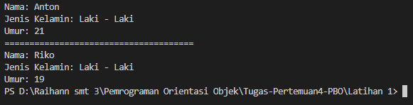

# Tugas Pertemuan 4 
## Pemrograman Orientasi Objek

```sh
Nama   : Raihan Tantowi
Nim    : 312110229
Matkul : Pemrograman Orientasi Objek
```

### 1. Folder Latihan 1
program latihan 1 ini adalah membuat class Person lalu membuat 2 buah objek yang bernama Antor dan Riko dan pastinya membuat 2 file dengan codingan yang berbeda, file 1 untuk pendeklarasian class dan file 2 untuk membuat objek nya, masing - masing objek tersebut memiliki atribut seperti nama, Jeniskelamin, dan umur, lalu atribut ini akan dijadikan sebuah *"inputan"* yang nantinya akan menghasilkan sebuah *"output"*.

* **CODINGAN FILE 1 (Person.java):**
```java
public class Person{
    String Nama;
    String JenisKelamin;
    int Umur;
    }
```

* **CODINGAN FILE 2 (PersonN.java):**
```java
public class PersonN{
    public static void main(String[] args){
    // Membuat object
    Person Anton = new Person();
    Person Riko = new Person();
    /* memanggil atribut dan memberi nilai */
    Anton.Nama = "Anton";
    Anton.JenisKelamin = "Laki - Laki";
    Anton.Umur = 21;
    Riko.Nama = "Riko";
    Riko.JenisKelamin = "Laki - Laki";
    Riko.Umur = 19;
    System.out.println("Nama: " + Anton.Nama);
    System.out.println("Jenis Kelamin: " + Anton.JenisKelamin);
    System.out.println("Umur: " + Anton.Umur);
    System.out.println("======================================");
    System.out.println("Nama: " + Riko.Nama);
    System.out.println("Jenis Kelamin: " + Riko.JenisKelamin);
    System.out.println("Umur: " + Riko.Umur);
    }
    }
```

* **Hasil output program:**




### 2. Folder Latihan 2
Program latihan 2 ini adalah membuat *"class"* yang bernama AkunBank lalu kemudian membuat sebuah *"objek"* yang bernama AkunBankk dengan menetapkan nilai saldo awal Rp. 100000, program ini dibuat dengan mengaplikasikan penggunaan *"instance method"* yang kemudian method tersebut akan di panggil dan akan menampilkan sebuah ouput dari method tersebut, berikut adalah 3 instance method dari sebuah program : 
```md
* Method **simpanUang()** 
* Method **ambilUang()** 
* Method **cekSaldo()** 
```

* **CODINGAN FILE 1 (AkunBank)**
```java
public class AkunBank {
    int saldo;
    public AkunBank (int saldo){
        this.saldo=saldo;
         }
    
        public void cekSaldo(){
        System.out.println("Selamat Datang di Bank ABC");
        System.out.println ("Saldo saat ini : Rp. "+ saldo);
        System.out.println();
    }
    
        public void simpanUang (int simpanUang){
        this.saldo = 600000;
        System.out.println ("Simpan uang : Rp. " + simpanUang);
        System.out.println ("Saldo saat ini : Rp. " + saldo);
        System.out.println();
    }
        
        public void ambilUang (int ambilUang){
        this.saldo = 450000;
        System.out.println ("Ambil uang : Rp. " + ambilUang);
        System.out.println ("Saldo saat ini : Rp. " + saldo);
        System.out.println();
    }
}
```

* **CODINGAN FILE 2 (AkunBankk)**
```java
public class BankAction {
      public static void main(String[] args){
          AkunBank AkunBankk = new AkunBank( 100000);
          AkunBankk.cekSaldo();
          AkunBankk.simpanUang(500000);
          AkunBankk.ambilUang(150000);
    }
}
```

* **Hasil output program:**


